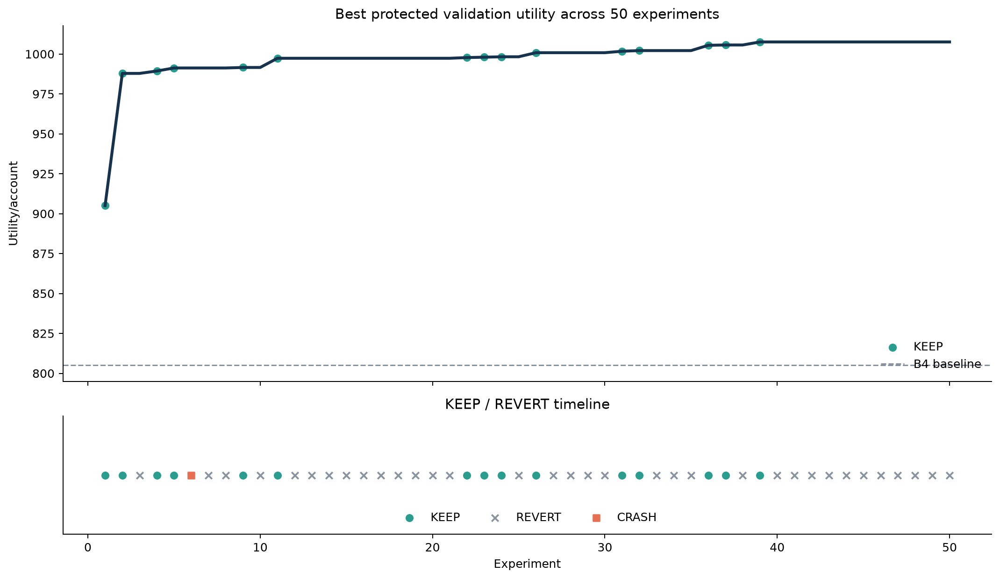
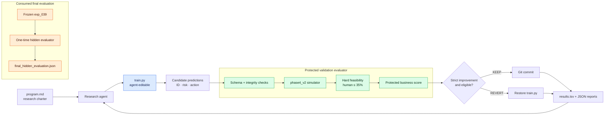
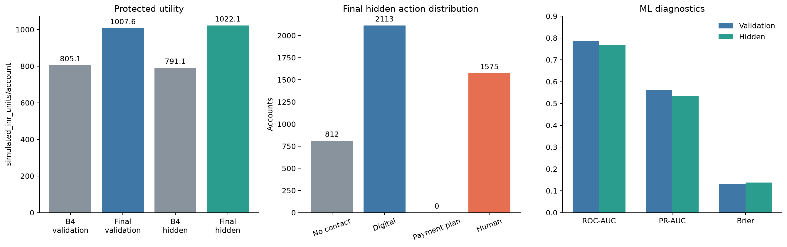
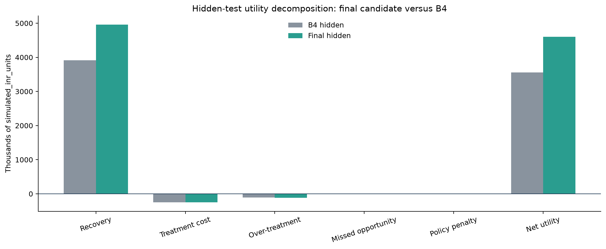

# AutoCollections Research

**Autonomous next-best-action research for financial operations, evaluated with a frozen,
deterministic business simulator and hard operational constraints.**

> All monetary values are `simulated_inr_units`. They are benchmark outputs—not observed
> bank savings, collections recovery, revenue, or causal treatment effects.

## Headline result

Fifty autonomous experiments produced 15 KEEP decisions and selected `exp_039` before the
hidden test was opened. The final policy improved hidden utility/account by **29.1964%**
over the frozen B4 benchmark, with a paired uplift of **230.9740/account** and a 95%
bootstrap confidence interval of **[181.1610, 285.8786]**.

| Result | Utility/account |
|---|---:|
| B4 validation benchmark | 805.1445 |
| Final validation (`exp_039`) | 1007.5752 |
| B4 hidden test | 791.1042 |
| Final hidden test | **1022.0782** |

```text
Hidden improvement over B4: +29.1964%
Paired hidden uplift:       +230.9740/account
Paired bootstrap 95% CI:    [181.1610, 285.8786]
```



## Business problem

A collections operation cannot treat every account identically. Contact consumes money
and customer attention; payment-plan review and human escalation consume progressively
scarcer capacity; no contact can miss recoverable value. The decision is therefore not
just “who might default?” but “which permitted action should this account receive under
cost, experience, and operational constraints?”

## Why risk prediction is insufficient

A high default probability does not establish that an expensive action is appropriate.
The same risk can correspond to different exposure, payment behavior, utilization, and
delinquency patterns. AutoCollections separates:

```text
risk model → treatment policy → action
```

from the protected evaluation process:

```text
approved behavior + offline outcome → simulated response → utility
```

ROC-AUC, PR-AUC, and Brier score remain diagnostics. KEEP decisions depend on feasible
protected business utility.

## AutoResearch architecture



- `train.py` was the only research implementation modified autonomously.
- Data preparation, approved features, simulator, feasibility, metrics, tests, and
  evaluator identity were protected by hashes.
- Rejected candidates restored only `train.py`; every outcome remained in the ledger.
- Hidden evaluation was a separate, one-time path after candidate selection.

## Dataset and leakage-safe split

The project uses the UCI **Default of Credit Card Clients** dataset (ID 350): 30,000
public rows under CC BY 4.0. It predicts `default_next_month` from financial and repayment
history.

| Split | Rows |
|---|---:|
| Train | 21,000 |
| Validation | 4,500 |
| Hidden test | 4,500 |

The split is deterministic and stratified. Rows with identical approved model features
are grouped into one split, eliminating cross-split duplicate leakage. The canonical split
SHA-256 is:

```text
6d8f4e9a9355cb49351af5fb83d6a6a938538d47c084fd039358cbed9ae0e0ec
```

`SEX`, `EDUCATION`, `MARRIAGE`, and `AGE` are excluded from every official model and
treatment-policy feature matrix.

## Protected evaluator

Evaluator `phase5_evaluator_v1` verifies the dataset, split, simulator, assumptions,
feasibility implementation, candidate schema, and strong baseline before scoring.

```text
Evaluator SHA-256:
ce12ee3e53f2af91ac7b00af24e50476fe28824dbf7d47c509608ee78ef46fc3
```

Candidate output is exactly:

```text
sample_id | predicted_probability | action
```

Invalid rows, actions, probabilities, ordering, protected-file changes, or hidden access
invalidate the candidate. Human escalation above 35% yields `PRIMARY_SCORE_ELIGIBLE=false`
and can never be KEEP-ed regardless of raw utility.

## Business simulator

`phase4_v2` is deterministic and uses only approved financial/behavioral inputs. It derives
simple ability-to-pay, engagement, and severity proxies, then calculates heterogeneous
action suitability:

```text
simulated recovery = exposure × action base effect × customer/action suitability
```

Utility reports recovery, treatment cost, over-treatment penalty, missed-opportunity
penalty, policy penalty, and net utility separately. Treatment effectiveness does not use
the candidate risk probability; the policy uses risk to choose an action, while the
protected simulator independently grades the action using behavior and the offline outcome.

The benchmark hierarchy was:

- B0: always no contact;
- B1: always digital reminder;
- B2: always payment-plan review;
- B3: original four-band risk policy;
- B4: top 35% risk to human, everyone else digital—the strongest feasible starting point.

## Experiment protocol

Each experiment followed one loop:

1. state one falsifiable hypothesis;
2. make one coherent `train.py` change;
3. run under a bounded, sanitized process environment;
4. validate protected hashes before and after execution;
5. accept only feasible strict score improvements;
6. commit KEEP candidates or restore REVERT/CRASH/INVALID candidates;
7. append exactly one TSV row and one JSON report.

The complete history is in [`results.tsv`](results.tsv). Research stopped permanently
after experiment 50.

## Research trajectory

| Milestone | Discovery | Validation utility/account |
|---|---|---:|
| B4 | Top 35% risk → human; remainder digital | 805.1445 |
| exp_001 | Risk × log exposure | 905.0170 |
| exp_002 | Risk × √exposure | 987.8621 |
| exp_009 | Exposure exponent 0.60 | 991.5793 |
| exp_011 | Add utilization-aware ranking | 997.3417 |
| exp_024 | Small HistGradientBoosting model | 998.2870 |
| exp_026 | Recent payment/bill behavior | 1000.8407 |
| exp_031 | No contact at zero exposure | 1001.7518 |
| exp_032 | Six-month mean payment ratio | 1002.1541 |
| exp_036 | Depth-constrained HGB | 1005.4787 |
| exp_037 | No contact below 1,000 exposure | 1005.6690 |
| exp_039 | Slower-learning final HGB | **1007.5752** |

Fifteen experiments were kept; 34 were reverted and one controlled crash verified recovery.

## Final policy

The selected `exp_039` model is a depth-3 `HistGradientBoostingClassifier` using approved
raw and derived features. Human allocation ranks accounts by:

```text
predicted risk
× positive current balance^0.60
× (1 + utilization)
× (2 - six-month mean payment-to-bill ratio)
```

- current positive balance below 1,000 → `NO_CONTACT`;
- top 35% allocation score → `HUMAN_ESCALATION`;
- remaining accounts → `DIGITAL_REMINDER`;
- `PAYMENT_PLAN_REVIEW` was not selected by the final policy.



## Validation versus hidden test

| Metric | Validation | Hidden | Change |
|---|---:|---:|---:|
| Utility/account | 1007.5752 | **1022.0782** | +14.5030 |
| ROC-AUC | 0.787476 | 0.768519 | -0.018958 |
| PR-AUC | 0.563510 | 0.534956 | -0.028554 |
| Brier score | 0.132534 | 0.137765 | +0.005231 |

The final hidden utility was 4,599,351.74 versus B4’s 3,559,968.70. The hidden gain
retained 114.10% of the validation uplift and was categorized as **strong generalization**.
The probability diagnostics weakened modestly; this did not negate the measured protected
business-utility improvement.



## Important failed experiments

Negative results were retained rather than hidden:

- linear exposure weighting and additive need scores underperformed multiplicative ranking;
- recent/persistent delinquency multipliers and balance-trend features added no utility;
- reducing human capacity below 35% consistently lost value;
- payment-plan fallback rules were close in places but never improved the accepted score;
- raw-only HGB lost value relative to approved derived features;
- deeper trees, larger leaves, stronger L2, balanced HGB, and a seven-leaf model regressed;
- sigmoid calibration and an HGB/logistic ensemble worsened treatment allocation;
- broader low-exposure no-contact rules sacrificed more recovery than they saved.

## Integrity and leakage prevention

- protected files are listed in `configs/protected_manifest.json`;
- evaluator identity and candidate lineage are SHA-256-addressed;
- validation labels never enter policy logic;
- row-level oracle actions are never exposed to `train.py`;
- duplicate approved-feature groups never cross split boundaries;
- all 50 experiments used the same validation evaluator;
- final selection was recorded before hidden outcomes were accessed;
- `train.py` remained byte-identical throughout final evaluation;
- no post-hidden tuning occurred.

> **Phase 7 has already been consumed.** `scripts/final_eval.py` is historical/final-only.
> Do not run it as part of reproduction. A one-time start marker prevents accidental reruns.

## Limitations

- UCI credit default is a proxy dataset, not real collections-treatment data.
- Treatment responses are simulated and are not causal treatment-effect estimates.
- `simulated_inr_units` are not realized savings, revenue, or avoided credit loss.
- Demographic variables were excluded; this does not eliminate all proxy/fairness risks.
- Payment-plan review was never selected by the final policy on validation or hidden data.
- The 35% human-escalation capacity is an assumed operational constraint.
- The simulator’s behavioral proxies and economics are explainable assumptions, not
  externally validated collections effects.
- Isolation protects the research process and detects file changes; it is not a hostile-code
  security sandbox.

## Reproduction

Requires Python 3.12 and [`uv`](https://docs.astral.sh/uv/).

```bash
# Environment
uv sync --locked

# Public data preparation and frozen evaluator verification
uv run prepare.py
uv run python scripts/check_protected.py

# Validation-only risk baselines
uv run python -m autocollections.evaluation.baselines

# Selected-policy validation dry run (never accesses hidden outcomes)
uv run train.py

# Rebuild presentation figures from existing frozen artifacts
uv run python reports/generate_figures.py

# Inspect the complete historical ledger
column -t -s $'\t' results.tsv | less -S
```

The final hidden artifact is available for inspection at
`reports/final_hidden_evaluation.json`; there is intentionally no reproduction command for
rerunning it.

If UCI retrieval is unavailable, place the original workbook at
`data/raw/default_of_credit_card_clients.xls`. Raw and processed data are excluded from Git.

## Repository structure

```text
AutoCollections-Research/
├── prepare.py                         # protected data/research entry point
├── train.py                           # frozen selected candidate; formerly agent-editable
├── program.md                         # research charter
├── results.tsv                        # append-only 50-experiment ledger
├── configs/
│   ├── benchmark.yaml
│   ├── business_simulation_v2.yaml
│   └── protected_manifest.json
├── autocollections/
│   ├── data/                          # loading, schema, deterministic grouped split
│   ├── features/                      # approved financial features
│   ├── evaluation/                    # metrics, feasibility, protected evaluator
│   └── simulator/                     # frozen heterogeneous response simulator
├── scripts/
│   ├── check_protected.py
│   ├── run_experiment.py              # historical autonomous runner
│   └── final_eval.py                  # consumed one-time hidden evaluator
├── reports/
│   ├── final_selection_manifest.json
│   ├── final_hidden_evaluation.json
│   ├── generate_figures.py
│   └── figures/
└── tests/                              # evaluator, isolation, simulator, runner tests
```

## References

- [Karpathy AutoResearch](https://github.com/karpathy/autoresearch)
- [UCI Default of Credit Card Clients](https://archive.ics.uci.edu/dataset/350/default+of+credit+card+clients), DOI `10.24432/C55S3H`

No source author or institution is implied to endorse this project or its simulated
business evaluator.
